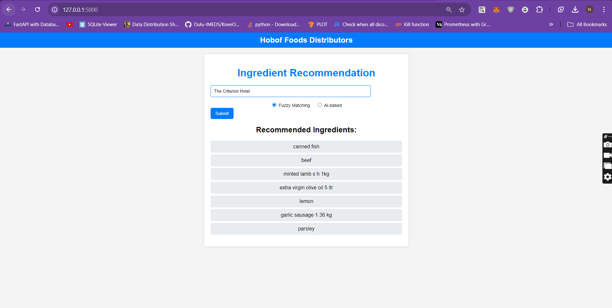

# HOBOF Recommendation System
An automated solution for getting the recommendation of ingredients/products that the restaurants, bars, pubs, etc. of Sydney CBD 2000 will use.

## Table of Contents
- [Project Overview](#overview)
- [Approach](#approach)
- [Implementation Flow](#implementaion)
- [Data](#data)
- [Installation](#installation)
- [Usage](#usage)
- [Tech Stack](#technologies-used)
- [Contact](#contact)

## Overview
* The task of helping Ari, a sales rep at Hobof Foods Distributors, make smarter product suggestions for venues in Sydney CBD can be broken down into four key steps:
  * Web Scraping of Menus: The goal is to extract dish names, ingredients, and menu data from restaurants, cafes, and bars in Sydney CBD. This involves using web scraping tools like BeautifulSoup for parsing HTML and Selenium for dynamic content.
  * Ingredient Extraction: Once the menus are scraped, the next step is to extract ingredients using natural language processing (NLP) tools like spaCy or nltk. The process involves cleaning the data and detecting ingredients, potentially requiring custom rules or regex patterns to handle variations and aliases (e.g., "eggplant" vs. "aubergine").
  * Matching Ingredients to Products: The extracted ingredients need to be matched with products from the "PremierQualityFoodsBrochure2021.pdf" catalogue. Using tools like PyPDF2 to extract PDF content, fuzzy matching algorithms (such as RapidFuzz) will map menu ingredients to catalogue products, accounting for name variations and spelling differences.
  * Sales Suggestions: The final step is providing Ari with product recommendations via a user interface. By entering a venue name, the system will match dishes and ingredients with products and suggest the best matches using a database of scraped menus and catalogues. Over time, suggestions can improve through machine learning or rule-based recommendations, and the interface can be built using Flask or FastAPI, integrated with conversational AI tools for a more natural experience.
 
 ## Approach

### 1. Scraping Menus from Sydney CBD 2000
**Objective**: I gathered menus from restaurants, cafes, and bars in Sydney CBD 2000.

#### Method:
- **Identified websites**: I used sources like Timeout, TripAdvisor, OpenTable, Yelp and Llama to gather venue names and websites. I partially automated this using SerpAPI.
- **Scraped the menus**: I used web scraping tools like BeautifulSoup, selenium and Scrapy to extract menus (in both HTML and PDF formats) from the venue websites.
- **Data storage**: I stored the scraped data in a structured format (CSV) with columns for venue names, dish names, and ingredients.

### 2. Extracted Key Details (Dish Names and Ingredients)
**Objective**: I parsed dish names and ingredients from the menu data.

#### Method:
- **Text extraction**: For HTML menus, I extracted dish and ingredient information using parsing methods such as regex. For PDF menus, I used PyPDF2 and pdfplumber to extract the text along with llama3.1 model to extract the restraunts, dishes, ingredients.
- **Structured data**: I organized the extracted information into a structured format, establishing a clear relationship between dish names and their ingredients.

### 3. Derived Ingredients
**Objective**: I standardized and cleaned the ingredients data.

#### Method:
- **Ingredient parsing**: I used NLP tools like spaCy, BERT, NLTK to identify and extract core ingredients.
- **Standardization**: I handled edge cases where ingredients had aliases (e.g., "chickpeas" and "garbanzo beans") by implementing a data-driven approach to mapping these aliases.
  * Since I did not have a predefined mapping of aliases, I used an unsupervised machine learning algorithm, specifically KMeans, to cluster similar ingredients based on their semantic similarity.
  * By generating word embeddings using a natural language processing model (like spaCy), I captured the semantic relationships between ingredients. Similar ingredients had similar embeddings, which I grouped into clusters using KMeans. Ingredients in the same cluster were considered aliases or variations of each other.
 
### 4. Matched Ingredients with Products
**Objective**: I mapped the extracted ingredients to products in the `PremierQualityFoodsBrochure2021.pdf`.

#### Method:
- **Parsed the PDF**: I used PyMuPDF and pdfplumber to extract product details such as product names and categories from the PDF.
- **Ingredient matching**: I matched the derived ingredients with the products in the PDF using a combination of exact name matches and fuzzy matching techniques. I used fuzzywuzzy and RapidFuzz to implement this.
- **Product recommendations**: I stored the matched results in a structured format, linking each venue to potential product suggestions.

### 5. Sales Suggestions WebApp
**Objective**: I offered venue-specific product suggestions in through a WebApp where Ari can put Restautrant/Bars/Pubs name and get the product suggestions.

#### Method:
- **Interface**: I built a simple web interface using Flask with HTML/CSS/JS, allowing the user to input a venue name and choose between whether Ari want result from AI or fram fuzzy matching.
- **Product suggestion**: Based on the input venue, I matched it with the scraped menu id he has chosen FUZZY and Run through AI if he choose AI-based and displayed product suggestions based venue type.
 
## Implementation


## Data
Data that is being used in order to complete this project can be accessed here
```bash
   https://drive.google.com/file/d/1PYQdGHW3b1g47GrPeZOxR7-Iw3kpoqnv/view?usp=drive_link
   ```

## Installation
* Cloning the repository
```bash
   git clone https://github.com/username/project-name.git
   ```
* Docker image build 
```bash
   docker build -t IMAGE_NAME:Version .
   ```
* Once the docker image is created, Put it in the docker-compose.yml file.
```bash
   docker-compose up -d
   ```
* This will start the web app on 5000 port.
* PS : if you don't want to build a docker image, you can just run docker-compose command it will generate it automatically and start the container on 5000 port

## Usage
This web application helps restaurants receive smarter product suggestions by analyzing their menu and matching ingredients with product catalogs.

### Prerequisites
- Dockers
- linux

### Access the Web App
1. Visit http://123.345.23.1:5000/. (dummy)
2. If running locally, navigate to the project directory and start the server:
   ```bash
   python app.py
   ```
3. Once the server is running, go to `http://127.0.0.1:5000` in your browser.

### How to Use
1. Enter the restaurant name into the input field on the homepage.
2. Choose between "AI-based" or "Fuzzy matching" ingredient recommendations using the radio buttons.
3. Click the "Submit" button to get product suggestions.
4. Review the results, which show Product that Ari can pitch to the input restaurants.
### Example:



### Use Case
* Sales reps can find matching products in the catalog for specific dishes offered by restaurants.

## Tech Stack
- Python (Flask, BeautifulSoup, Pandas, numpy, tensorflow, keras, tranformers, selenium, NLP, NLTK, Spacy, fuzzy matching, pdfplumber etc.)
- JavaScript (Frontend scripting)
- HTML & CSS (Frontend design)
- CSV
- Dockers
- GCP


## Contact
[Nimesh Kumar](https://github.com/NonlinerNimesh) - imnimeshkumar@outlook.com
